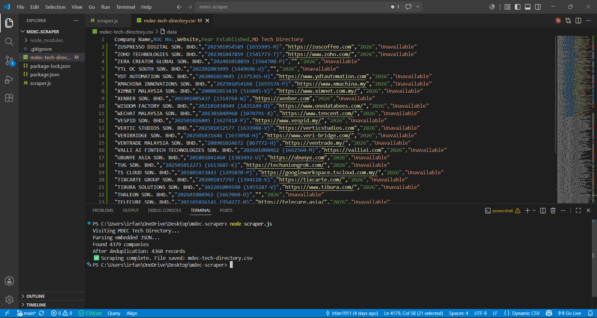
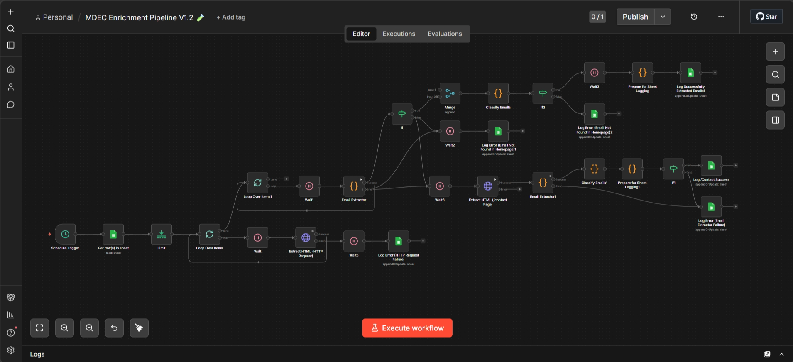
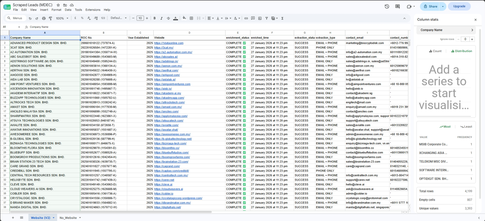

# MDEC Scraper — Malaysia Digital Company Intelligence Pipeline

MDEC Scraper is a two-stage data pipeline that extracts the full Malaysia Digital technology company directory from [MDEC (Malaysia Digital Economy Corporation)](https://mdec.my/ms/malaysiadigital/companies) and automatically enriches each record with publicly available contact information.

**Stage 1** intercepts the embedded `__NEXT_DATA__` JSON payload from the directory's Next.js application, extracting all company records in a single pass — bypassing DOM scraping entirely. **Stage 2** runs an n8n automation workflow that visits each company's website, extracts contact emails and phone numbers, and writes the enriched data back to a Google Sheet.

The project was built to explore how understanding a website's rendering architecture can simplify data extraction, and how workflow automation can scale contact enrichment across thousands of companies without manual effort.

## Problem

The MDEC Malaysia Digital directory lists thousands of registered technology companies, but provides limited utility for outreach or research:

1. Company records are rendered across a paginated frontend with no public API or export option
2. Traditional DOM scraping would require handling dynamic pagination, JavaScript rendering, and anti-scraping measures
3. Manual collection and verification of 4,000+ records is impractical
4. Even after extraction, the directory provides no contact details — emails and phone numbers must be sourced from each company's own website individually

MDEC Scraper was designed to solve both problems: extract the complete directory efficiently, then enrich it with actionable contact data automatically.

## What It Does

### Stage 1 — Directory Extraction
1. **Launch** — Playwright spins up a headless Chromium browser and navigates to the MDEC directory
2. **Intercept** — Instead of scraping DOM elements, the tool extracts the `__NEXT_DATA__` JSON payload embedded in the page's server-side rendered HTML
3. **Parse** — The raw JSON is traversed to locate the company records array within the Next.js page props
4. **Deduplicate** — Records are filtered by ROC (Registration of Companies) number to eliminate duplicate entries
5. **Export** — The cleaned dataset is written to a structured CSV file and uploaded to Google Sheets for the enrichment stage

### Stage 2 — Contact Enrichment (n8n)
6. **Read** — The n8n workflow reads company records from the Google Sheet in batches
7. **Visit** — Each company's website homepage is fetched and its HTML is extracted
8. **Extract** — Contact emails and phone numbers are extracted from the homepage using pattern matching
9. **Fallback** — If no contact details are found on the homepage, the workflow navigates to the company's `/contact` page and repeats extraction
10. **Write** — Successfully extracted contact details are written back to the Google Sheet alongside the original company data

## Key Results

- **4,195 unique companies** extracted after deduplication (from ~4,214 raw records)
- **3,391 companies** with a website URL available for enrichment (80.8% coverage)
- **1,529 companies** successfully enriched with contact email, phone number, or both — a **45.1% enrichment rate** across all companies with websites
- **Single-pass extraction** — entire directory captured in one page load via `__NEXT_DATA__` interception
- **Zero manual research** — the full pipeline from directory scraping to contact enrichment runs without human intervention

## Data Schema

| Field              | Description                                | Coverage |
|--------------------|--------------------------------------------| ---------|
| Company Name       | Registered company name                    | 100%     |
| ROC No.            | Malaysian registration number              | 100%     |
| Website            | Company website URL                        | 80.8%    |
| Year Established   | Year of company registration               | 100%     |
| Contact Email      | Extracted email address (enriched)         | 36.4%    |
| Contact Number     | Extracted phone number (enriched)          | 36.4%    |

## Tech Stack

**Runtime:** Node.js  
**Browser Automation:** Playwright (headless Chromium)  
**Workflow Automation:** n8n  
**Data Storage:** Google Sheets API  
**Data Export:** csv-writer  
**Target Architecture:** Next.js `__NEXT_DATA__` JSON extraction

## System Architecture

The pipeline is split into two independent stages connected through Google Sheets as the shared data layer.

```
Stage 1: Directory Extraction          Stage 2: Contact Enrichment
┌─────────────────────────┐            ┌──────────────────────────────────┐
│  MDEC Directory (Web)   │            │  n8n Workflow                    │
│         │               │            │         │                        │
│    __NEXT_DATA__        │            │  Read from Google Sheet          │
│    JSON Extraction      │            │         │                        │
│         │               │            │  Visit Company Homepage          │
│    ROC Deduplication    │            │         │                        │
│         │               │    ┌───▶   │  Extract Emails & Phone Numbers  │
│    CSV Export ──────────┼────┘       │         │                        │
│         │               │            │  Fallback: Visit /contact Page   │
│    Google Sheet Upload  │            │         │                        │
└─────────────────────────┘            │  Write Enriched Data Back        │
                                       └──────────────────────────────────┘
```

## Architecture Highlights

- **`__NEXT_DATA__` interception** — exploits Next.js server-side rendering by extracting the full dataset from the embedded JSON script tag rather than scraping rendered DOM elements, eliminating the need for pagination, scroll handling, or element selectors
- **ROC-based deduplication** — uses the unique Registration of Companies number as a deduplication key, resolving duplicate entries present in the raw directory data
- **Two-pass contact extraction** — the enrichment workflow first scans the company homepage for contact details; if none are found, it automatically navigates to the `/contact` page as a fallback, maximizing extraction coverage
- **Google Sheets as shared data layer** — decouples the scraper from the enrichment workflow, allowing each stage to run independently and enabling manual review of intermediate results

## Screenshots

### MDEC Source Directory


### Scraper Execution


### n8n Enrichment Pipeline


### Enriched Dataset


## Validated Results

Tested against the full MDEC Malaysia Digital directory:

| Metric | Value |
|--------|-------|
| Total companies extracted | 4,195 |
| Companies with website | 3,391 (80.8%) |
| Successfully enriched | 1,529 (45.1% of companies with websites) |
| Enrichment method | Homepage scan + /contact page fallback |

## Repository Scope
This repository serves as a project showcase. The scraper script, n8n workflow definitions, and Google Sheets integration are part of the supporting infrastructure and are not included.

- [ ] Commit and push changes

